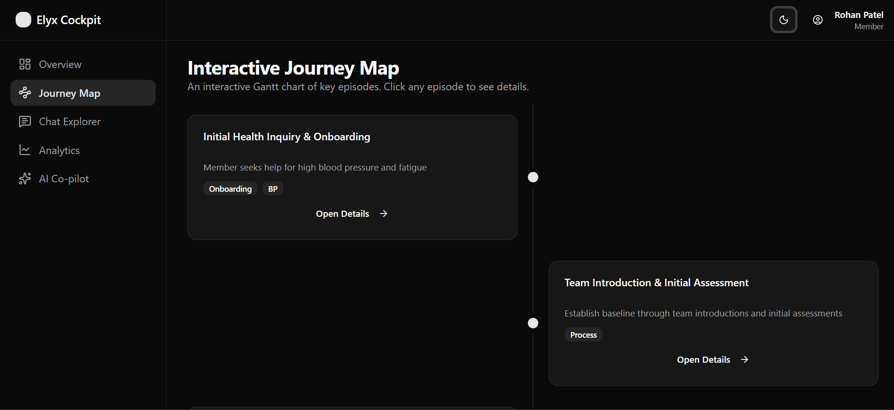
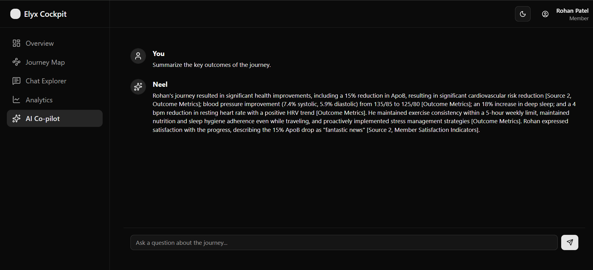

# [Elyx Cockpit](https://elyx.onrender.com/)


This repository contains our submission for the Pclub IITK x Elyx Hackathon. Elyx Cockpit is a decision-intelligence platform designed to visualize and analyze a member's complex, year-long health journey, providing not just insights, but auditable, evidence-based traceability for every decision made.

This readme documents the architectural choices, technical implementations, and the core philosophy behind our approach.

Live at [https://elyx.onrender.com/](https://elyx.onrender.com/). 
As the deployment is made with Free tier of render, the free instance spins down sometimes due to inactivity. Wait for a while for it to spin back up and see it in action. 

## Our Core Philosophy

From the start, our goal was to build something scalable, useful, and insightful that goes a little bit beyond just the problem statement. We didn't just want to display data; we wanted to tell a story and make every insight accountable.

We have created a dynamic system. You can put your messages in the `lib/journey/journey.txt` file and run the `jouney.js` script to parse it into a JSON using regex and then place that JSON in `public/jouney_log.json` and it will be available to the app. If you generate an analysis of it like `public/episode.json` and replace it there then that would also reflect.

### Narrative-Driven Visualization
We believe that a member's journey is a story, not just a collection of data points. Every interface, from the overview dashboard to the custom-built journey map, is designed to present information in a narrative context. We use dynamic animations, progressive disclosure, and logical flows to guide the user through the member's progress, challenges, and successes over time.

### Accountable, Evidence-Based AI
The core challenge of the PS is to understand the "why" behind any decision. We took this to heart by building an AI Co-pilot that doesn't just give answers, but proves them. Our RAG pipeline is engineered to link every claim back to the specific message or data point that serves as its evidence, creating a system of radical transparency and trust.

## Tech Stack

-   **Framework:** Next.js 14 (App Router)
-   **UI:** React, TypeScript, Shadcn UI, Tailwind CSS
-   **Animation:** Framer Motion
-   **AI & Backend:** LangChain.js, Google Gemini
-   **Vector Store:** `MemoryVectorStore` (in-memory for hackathon speed)
-   **Styling:** PostCSS, Autoprefixer

## Features Showcase

Our application is a multi-faceted cockpit, with each page serving a distinct analytical purpose.

#### 1. Overview: The Narrative Hub

The landing page provides a high-level, narrative summary of the entire journey.
-   **At-a-Glance KPIs:** Key biomarker improvements and engagement metrics.
-   **Dynamic Animations:** All elements animate into view for a polished, modern feel.
-   **Journey Highlights:** AI-summarized "Key Turning Points" and "Sustainability Factors" to quickly understand the story.
-   **Predictive Analysis:** A forward-looking view of success probability and potential risks.


#### 2. Journey Map: The Interactive Timeline

A bespoke, vertical timeline that visualizes the chronological flow of the member's journey episodes.
-   **Custom Built:** We moved away from pre-built libraries to create a clean, alternating card layout inspired by professional designs.
-   **Scroll-Triggered Animations:** Each episode card gracefully animates into view.
-   **Progressive Disclosure:** A clean summary is presented upfront, with an accordion to reveal deeper details like key interactions and persona evolution, preventing information overload.
-   **Seamless Drill-Down:** Each card links to a side-sheet (`Sheet`) that provides a rich, detailed view of the selected episode.

#### 3. Chat Explorer: The Forensic Tool

A powerful interface for searching, filtering, and analyzing the raw `journey_log.json` data.
-   **Advanced Filtering:** Search by keyword, sender, and role to instantly narrow down hundreds of messages.
-   **Intelligent Scannability:** Sticky date separators are automatically injected into the message stream, making it easy to navigate long conversations.
-   **Dynamic Insight Panel:** A context-aware side panel that shows a summary of the currently filtered view, and switches to a detailed analysis when a specific message is selected.
-   **AI-Powered "Decision Trace":** A "Why this?" button on every message calls a dedicated API endpoint to provide AI-generated context and rationale for that specific communication.

#### 4. AI Co-pilot: The Generative Interface

A conversational AI, powered by our RAG pipeline, that can answer high-level questions about the entire journey.
-   **Guided Interaction:** Suggested prompts are provided to the user to showcase the AI's capabilities and eliminate the "blank page" problem.
-   **Rich Markdown Responses:** The AI responds with formatted text, including lists, bolding, and more, for superior readability.
-   **Verifiable Citations:** The "wow" feature. The AI's response includes clickable citation markers `[1]` that link directly to the specific message in the Chat Explorer that was used as evidence, fulfilling the core requirement of the problem statement.


## Our Approach to Task 1 & 2: The RAG-Powered Backend

### Communication Message Generation (Task 1)
To simulate an 8-month conversation while avoiding *Context Window Limitation* and *Hallucination*, we broke the generation process into month-long chunks. We preserved a state summary after each month, which was fed into the prompt for the next month, ensuring continuity. This role-based, zero-shot prompting approach allowed us to generate a diverse and realistic conversation log (`journey_log.json`) and a high-level summary (`episode.json`).

Access the [prompt](./docs/comm-generator-prompt.md) and the [messages](./lib/journey/journey.txt)

### The "Insight & Evidence" Architecture (Task 2)
Our core technical insight was to treat the two generated files as distinct but connected layers of information:
-   `journey_log.json`: The **Ground Truth**. This is the raw, immutable log of every interaction—the evidence.
-   `episode.json`: The **Narrative Layer**. This is an AI-generated summary that provides structure and tells the story of the journey.

Our RAG pipeline indexes **both** files into a `MemoryVectorStore`. This allows our AI to retrieve both fine-grained conversational details and high-level episode summaries, providing the richest possible context for any query. The `eventId` from the message log is stored in the vector metadata, which is the key to our citation feature.

## Getting Started

First, install all dependencies:

```bash
pnpm install
```

Create an `.env` file from `.env.example`:

```bash
GEMINI_API_KEY=your_google_api_key
```

Then, run the development server:

```bash
pnpm dev
```

Open [http://localhost:3000](http://localhost:3000) with your browser to see the result.

### Team
-   [Coder-senpai123](https://github.com/coder-senpai123/)
-   [Krishnaag23](https://github.com/krishnaag23/)
