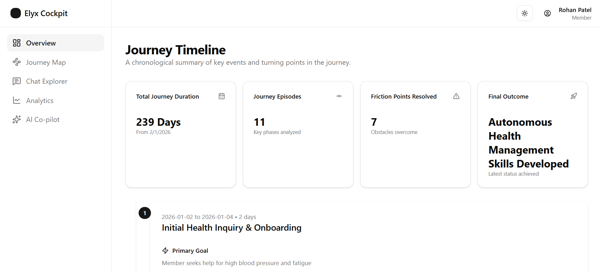
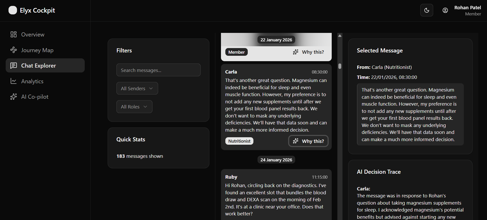
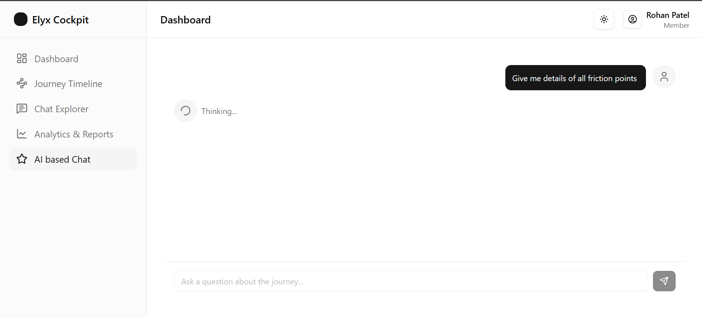

# Elyx Hackathon (Sloth)

This repository is our submission for the Pclub IITK X Elyx Hackathon. Here is the [problem statement](docs/Elyx%20Life%20-%20Hackathon%20Problem%20Statement%20.pdf). 

This readme is WIP and would reflect our various approaches that we take and the thought that goes behind those approaches and specifics.





## Our Goal From this Hackathon
We want to create something good, scalable and useful for this hackathon that goes a little bit beyond just the PS.
Through this process we would also learn and explore. 

### Communication Message Generation (Task 1)
As the task is to simulate 8-month long converstations we face problem of *Context Window Limitation* and *Hallucination* of the LLMs. The restrictions on this conversation mentioned in the PS provide additional problems. To tackle these we break down our task into month long simulations and preserve a state along with history (summary) to take care of continuity and above problems. Our research shows that LLMs perform best in such task through a role based approach. Also we have approached this with *zero-shot prompting* technique so as to not have a similar chat generated. 

## Getting Started
Fist, Install all dependencies :

```bash
pnpm install
```
Create an `.env` file from `.env.example` 

```bash
GOOGLE_API_KEY=your_google_api_key
```

Then, run the development server:

```bash
npm run dev
```

Open [http://localhost:3000](http://localhost:3000) with your browser to see the result.

### Team
[Coder-senpai123](https:github.com/coder-senpai123/)
[Krishnaag23](https://github.com/krishnaag23/)